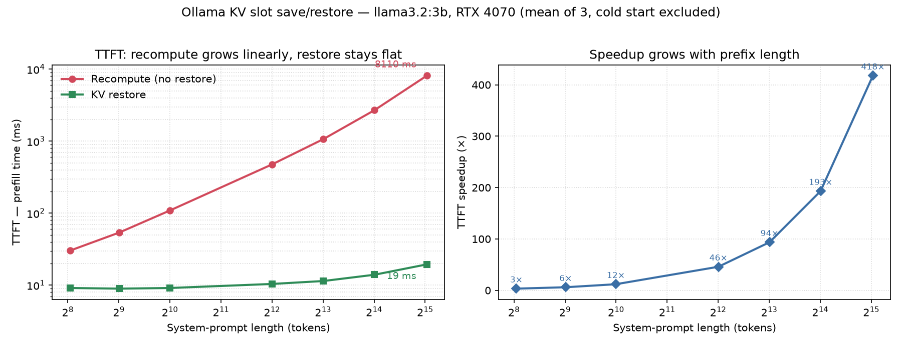

# ollama-prefill-kv-restore

**Opt-in KV-cache (prefill) save/restore for Ollama — up to 417× faster TTFT on a fixed system prompt.**

A single-user local agent usually prepends the *same* large system prompt
(rules, tool definitions) on every turn. Ollama recomputes that full prefill on
each request, so every turn pays a fixed time-to-first-token (TTFT) cost that
grows with the prompt length.

The bundled `llama-server` already knows how to persist a slot's KV cache to disk
(`--slot-save-path`), but Ollama never passes the flag and never exposes the
endpoints. This work adds a small **opt-in** path so that the fixed prefix can be
prefilled *once*, saved, and **restored** before later requests — collapsing the
repeated prefill into a near-constant ~10–20 ms.

This repo holds the **reproducible benchmark and results**. The implementation is
proposed upstream to Ollama (see [Upstream](#upstream)).

## Headline result

`llama3.2:3b`, RTX 4070, flash attention on. TTFT is the llama.cpp `/completion`
prefill time, mean of 3 runs after a forced cache eviction, cold-start iteration
discarded.

| System prompt (tok) | Recompute TTFT | Restore TTFT | Speedup |
|---:|---:|---:|---:|
| 264 | 30.2 ms | 9.1 ms | 3.3× |
| 516 | 53.9 ms | 8.9 ms | 6.0× |
| 1,020 | 108.5 ms | 9.1 ms | 11.9× |
| 4,107 | 476.7 ms | 10.4 ms | 45.9× |
| 8,223 | 1,067 ms | 11.4 ms | 93.6× |
| 16,455 | 2,692 ms | 13.9 ms | 193× |
| 33,486 | 8,110 ms | 19.4 ms | **417×** |



**Restore cost is roughly flat (~9–19 ms); recompute is ~linear in tokens** — so
the win grows with prefix length, from 3.3× at 256 tokens to **417× at ~33K**.
This is purely a *prefill* win: decode throughput (tokens/s) is unchanged.

## How it works

When the opt-in env var `OLLAMA_SLOT_SAVE_PATH` is set, the forked Ollama:

1. launches `llama-server` with `--slot-save-path <dir>`, and
2. exposes two experimental endpoints that go through the runner (serialized
   against inference via the same semaphore as the completion path):
   - `POST /api/experimental/kv/save`    `{"model": "...", "filename": "sys.bin"}`
   - `POST /api/experimental/kv/restore` `{"model": "...", "filename": "sys.bin"}`

When the env var is **unset**, behaviour is byte-for-byte identical to stock
Ollama. Save/restore requires `OLLAMA_NUM_PARALLEL=1` (single-user, serial-request
use case); `filename` is restricted to a basename so saves can't escape the dir.

## Reproduce

Requires the forked Ollama running with the feature enabled (single user):

```bash
OLLAMA_SLOT_SAVE_PATH=/tmp/ollama-kv \
OLLAMA_NUM_PARALLEL=1 \
OLLAMA_FLASH_ATTENTION=true \
OLLAMA_CONTEXT_LENGTH=34816 \
  ollama serve            # on a non-default port, e.g. :11436
```

Then:

```bash
pip install matplotlib            # only plot_kv_sweep.py needs it
python bench_ollama_kv_sweep.py   # writes results/bench_ollama_kv_sweep.json
python plot_kv_sweep.py           # writes results/kv_sweep.png
```

The benchmark sweeps system-prompt length 256 → ~33K tokens. For each length it
warms and **saves** the system prefix, then per iteration: evicts slot 0 and
measures the **recompute** TTFT, evicts again, **restores** the saved KV, and
measures the **restore** TTFT. One warm-up iteration is discarded; three are
averaged. Points are labelled by the exact saved token count (`n_saved`).

`OLLAMA` (host:port) and `MODEL` are overridable via env vars at the top of
`bench_ollama_kv_sweep.py`.

## Files

- [`bench_ollama_kv_sweep.py`](bench_ollama_kv_sweep.py) — the prefix-length sweep.
- [`plot_kv_sweep.py`](plot_kv_sweep.py) — renders the two-panel figure.
- [`results/bench_ollama_kv_sweep.json`](results/bench_ollama_kv_sweep.json) — raw timings (per-run, not just means).
- [`results/kv_sweep.png`](results/kv_sweep.png) — TTFT scaling (left) + speedup (right).

## Notes

- A model whose GGUF embeds a projector (e.g. some VL models) makes Ollama launch
  `llama-server` with `--mmproj` → multimodal mode, which rejects slot
  save/restore with `501 "not supported by multimodal"`. Use a pure text model
  (`llama3.2:3b`, `qwen2.5:3b`, `gemma2:2b`).
- This targets the single-user, serial-request path — not the multi-tenant path.

## Upstream

The implementation is proposed to the Ollama project as an opt-in,
off-by-default feature (`OLLAMA_SLOT_SAVE_PATH`, mounted under
`/api/experimental/`). This repo is the reproducibility companion: scripts, raw
JSON, and the plot.
